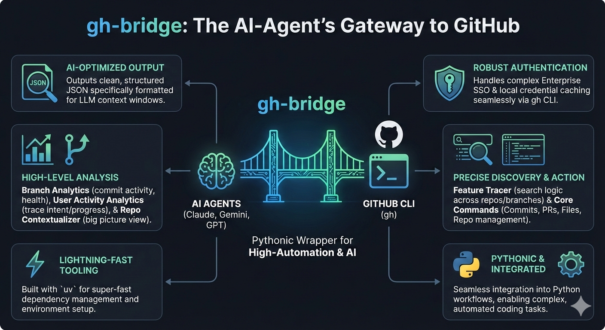

# 🌉 gh-bridge

A robust, Pythonic wrapper around the **GitHub CLI (`gh`)**, engineered specifically for **AI Agents** (like Claude, Gemini, and GPT) and high-automation environments.

[](https://github.com/MohamedHamed19m/agent-gh-hub/actions/workflows/test.yml)

[](https://python.org)
[](https://github.com/astral-sh/uv)



## 🎯 Why gh-bridge?

In many **Enterprise environments**, security policies often restrict or disable the use of Personal Access Tokens (both Classic and Fine-grained). This creates a "token wall" where traditional libraries like `PyGithub` or `ghapi` fail because they cannot navigate SAML/SSO requirements.

`gh-bridge` solves this by acting as a **Pythonic wrapper for the GitHub CLI (`gh`)**. Instead of fighting with API tokens, it leverages your existing CLI authentication state.

### 🔐 The Enterprise Advantage
* **SAML/SSO Compatibility:** If you can log in via `gh auth login` in your terminal, this package works. It inherits the browser-based SSO session seamlessly.
* **No Manual Configuration:** There is no need to manually set `GH_HOST` or `GH_ORG` variables for basic usage; the library automatically inherits the authentication context and host settings from your active `gh` CLI session.
* **Bypasses Token Restrictions:** Works in environments where creating/using personal tokens is strictly blocked by organization policy.
* **Zero Credential Management:** No need to store sensitive tokens in `.env` files or CI secrets; it uses the local system's secure credential store.
* **AI-Native Output:** While the raw CLI returns text, `gh-bridge` parses everything into structured JSON, optimized for LLM context windows and automated agents.

## 🛠️ Key Features

* **📊 Branch Analytics:** Analyze commit activity, contributors, and branch health metrics (`gh_wrapper.features.branch_analytics`).
* **🔍 Feature Tracer:** Search for logic or snippets across multiple repositories and branches (`gh_wrapper.features.feature_tracer`).
* **🤖 PR Review:** Automated change summary and review suggestions for Pull Requests (`gh_wrapper.features.pr_review_analyzer`).
* **👤 User Activity Analytics:** Trace a developer's recent work to understand intent and progress (`gh_wrapper.features.user_tracer`).
* **📂 Repo Contextualizer:** One-call "Big Picture" view (Files, PRs, Branches, and README) for LLM context windows (`gh_wrapper.features.repo_context`).
* **📝 Core Commands:** specialized wrappers for Commits, Pull Requests, Files, and Repository management.
* **⚡ Built with `uv`:** Lightning-fast dependency management and environment setup.

## 🚀 Quick Start

### Prerequisites
1. [GitHub CLI](https://cli.github.com/) installed and authenticated (`gh auth login`). 
   > **Tip:** Verify your connection by running `gh auth status`.
2. [uv](https://github.com/astral-sh/uv) installed.

### Setup
```bash
# Clone the repo
git clone https://github.com/MohamedHamed19m/gh-bridge
cd gh-bridge

# Sync environment
uv sync --all-extras
```

## 💻 CLI Usage

`gh-bridge` provides a powerful CLI interface designed for both AI agents (default) and humans (`--readable`).

### Agent Mode (Default)
Optimized for token efficiency using **TOON** and **Markdown**.
```bash
# Repository scan (TOON)
gh-bridge scan owner/repo

# Feature trace (TOON)
gh-bridge trace "authentication" --repos "owner/repo1,owner/repo2"

# Branch analysis (TOON)
gh-bridge analyze-branch owner/repo main

# PR Review (Markdown)
gh-bridge review-pr owner/repo 123
```

### Human Mode (`--readable`)
Formatted with **Rich** tables, panels, and colors.
```bash
gh-bridge scan owner/repo --readable
gh-bridge analyze-branch owner/repo main --readable
```

### Usage (Python API)

**Basic Repository Context:**
```python
from gh_wrapper.core.executor import GHExecutor
from gh_wrapper.features.repo_context import RepoContextAnalyzer

# Initialize executor with target repository
executor = GHExecutor(repo="owner/repo")

# Gather high-level context
analyzer = RepoContextAnalyzer(executor)
context = analyzer.analyze_current_context()

print(f"Repository: {context.get('target')}")
print(f"Default Branch: {context.get('metadata', {}).get('default_branch')}")
print(f"Files found: {len(context.get('structure', []))}")
print(f"Recent Commits: {len(context.get('activity', {}).get('recent_commits', []))}")
```

**Tracing Code Features:**
```python
from gh_wrapper.features.feature_tracer import FeatureTracer

tracer = FeatureTracer(executor)
# Search for 'auth' logic across main and develop branches
results = tracer.trace_code("auth", branches=["main", "develop"])
```

**Branch Activity Analytics:**
```python
from gh_wrapper.features.branch_analytics import BranchAnalyzer

analyzer = BranchAnalyzer(executor)
stats = analyzer.analyze_branch("main")

print(f"Branch: {stats.branch}")
print(f"Total Commits: {stats.total_commits}")
print(f"Top Contributor: {max(stats.contributors, key=stats.contributors.get)}")
```

**User Activity Analytics:**
```python
from gh_wrapper.features.user_tracer import UserTracer

tracer = UserTracer(executor)
# Trace recent work for a user within a specific repository
recent_work = tracer.trace_recent_work("MohamedHamed19m", "owner/repo")

for commit in recent_work:
    print(f"- {commit['sha']}: {commit['message']} ({commit['branch']})")
```

**Reading File Content:**
```python
from gh_wrapper.commands.files import FileManager

file_manager = FileManager(executor)
content = file_manager.get_file_content("pyproject.toml")
print(content)
```

### 🎨 Visual Demos
The project includes several specialized scripts in the `scripts/` directory to demonstrate core features with rich, interactive terminal output. These require the `fancy` extra:

```bash
# Install with fancy extras for rich output
uv sync --extra fancy

# Run the demos
uv run scripts/demo_repo_analysis.py
uv run scripts/demo_feature_tracer.py
uv run scripts/demo_trace_user_activity.py
uv run scripts/demo_pr_review.py
uv run scripts/demo_read_repo_context.py
uv run scripts/demo_file_manager.py
```

## 🏗️ Project Structure

```
src/gh_wrapper/
├── core/           # Core framework (Executor, Cache, Exceptions)
├── commands/       # API Wrappers (Commits, PRs, Files, Users)
└── features/       # High-level logic (Feature Tracer, Repo Context)
```

## 🧪 Testing

```bash
# Run unit tests
uv run pytest tests/unit

# Run integration tests (requires GH_TOKEN)
export RUN_INTEGRATION_TESTS=1
uv run pytest tests/integration
```

## 🤝 Contributing
Contributions are welcome! Please ensure all PRs pass the ruff linting and mypy type checks.

Created by MohamedHamed19m
